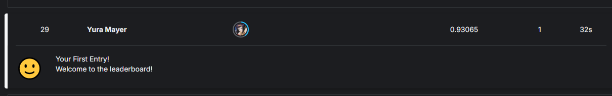

# Captcha Letter Classifier

Распознавание искажённых букв английского алфавита с помощью сверточной нейросети

## Код

Ноутбук с СNN моделью: [`notebook.ipynb`](notebook.ipynb)

## 🎯 Цель

Достичь accuracy ≥ 0.82 на Public Leaderboard: [kaggle.com/competitions/mipt-dl-captcha](https://www.kaggle.com/competitions/mipt-dl-captcha-2025)

## 🚀 Результат  

С помощью CNN, аугментации и 30 эпох обучения достигнута accuracy 0.93 😎

